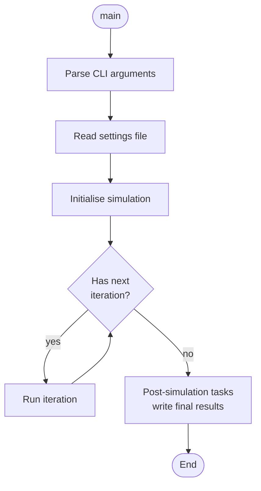
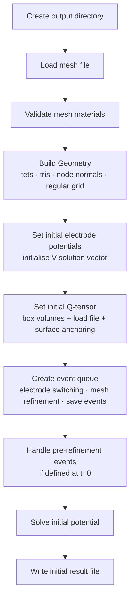
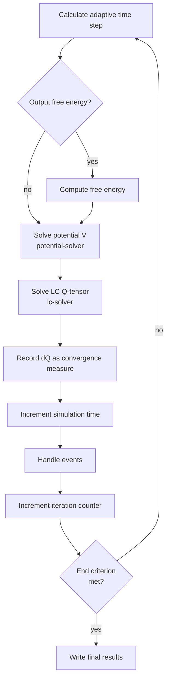
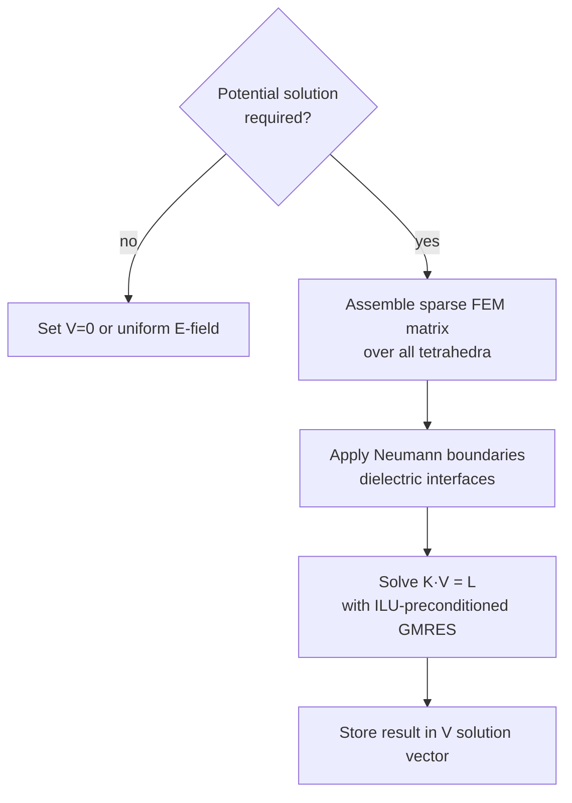
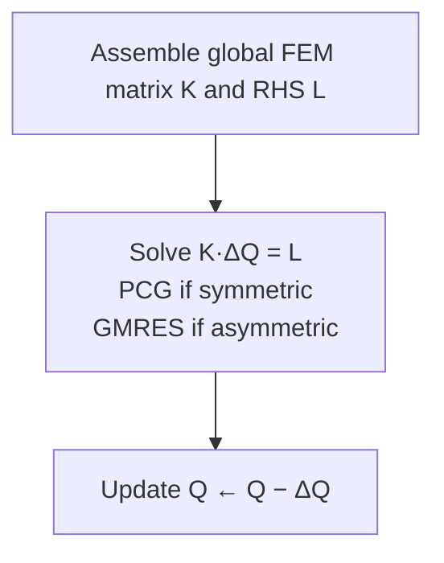
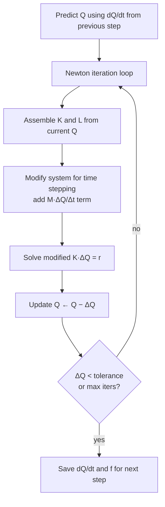
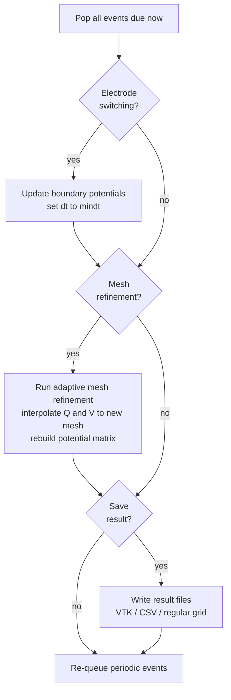
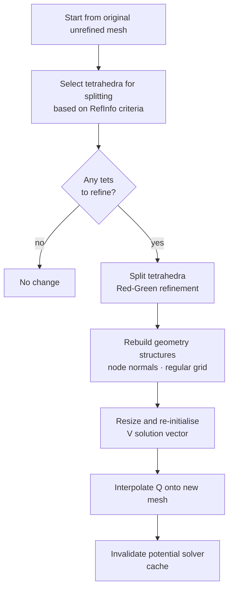

# qlc3d – High-Level Algorithm Flow

qlc3d is a 3-D finite-element liquid-crystal simulator.  It solves for the
equilibrium or time-evolution of the LC order-parameter tensor **Q** coupled
to the electrostatic potential **V** on an unstructured tetrahedral mesh.

---

## Top-Level Flow

The entry point is `main()` in `qlc3d/src/main-app-qlc3d.cpp`.  It delegates
all work to `SimulationContainer` (`simulation-container.cpp`).

---

## 1. Read Settings

`Configuration::readSettings()` parses the user-supplied `.qfg` settings
file via `SettingsReader`.  The following objects are populated:

| Object | Purpose |
|--------|---------|
| `Simu` | Simulation mode, time-step limits, end criterion, output format |
| `LC` | Material constants (elastic, thermotropic, dielectric, flexoelectric) |
| `Electrodes` | Electrode potentials and switching schedule |
| `Alignment` | Surface anchoring conditions |
| `MeshRefinement` | Adaptive mesh-refinement configuration |
| `SolverSettings` | Linear-solver tolerances, thread count |
| `InitialVolumeOrientation` | Box-based initial LC director field |

---

## 2. Initialisation

Key steps:

- **Mesh loading** – `MeshReader::readMesh()` reads Gmsh `.msh` (or legacy)
  format into raw node/element/material arrays.
- **Geometry** – nodes, tetrahedra, surface triangles, and (optionally) a
  regular Cartesian interpolation grid are built from the raw data.
- **LC initial conditions** – box regions set bulk Q, alignment surfaces set
  boundary Q, and an optional previously saved result can be loaded.
- **Event queue** – electrode-switching times and mesh-refinement
  triggers (by iteration number, simulation time, or periodically) are
  inserted into a priority queue for later processing.

---

## 3. Main Simulation Loop

The end criterion can be:

- **Iterations** – run exactly *N* steps.
- **Time** – run until simulation time ≥ T.
- **Change** – run until |dQ| per step falls below a threshold.

---

## 4. Adaptive Time Stepping

Used only in **TimeStepping** mode.  The step size for the next iteration is
interpolated from the ratio $R = \Delta Q_\text{target} / |\Delta Q|$:

- $R$ near 1 → scale dt linearly with R.
- $R \ll 1$ (change too large) → reduce dt aggressively.
- $R \gg 1$ (change too small) → increase dt, capped at 2×.

The step is also clamped to `[mindt, maxdt]` and shortened if it would
skip the next scheduled event.

See `SimulationAdaptiveTimeStep` (`simulation-adaptive-time-step.cpp`).

---

## 5. Solving the Electric Potential

`PotentialSolver::solvePotential()` solves the Poisson equation
$\nabla \cdot (\varepsilon \nabla V) = 0$ with Dirichlet boundary conditions
on electrode surfaces.

- Both LC and dielectric regions are handled; permittivity in LC elements is
  derived from the current Q-tensor.
- Optional **flexoelectric** polarisation terms contribute to the RHS.
- The sparse matrix is rebuilt each time but the sparsity pattern is fixed
  after the first solve and reused until the mesh changes.

---

## 6. Solving the LC Q-Tensor

Two solver variants exist, both inheriting from `ImplicitLCSolver`.

### 6a. Steady-State Solver (`SteadyStateLCSolver`)

Each call performs a single Newton step:

The matrix is assembled element-by-element using Gaussian quadrature on
tetrahedra.

### 6b. Time-Stepping Solver (`TimeSteppingLCSolver`)

Uses an implicit Adams–Bashforth-like scheme with Newton iterations within
each time step:

### Common FEM Assembly

For each tetrahedron the local stiffness matrix and RHS vector are formed by
Gaussian quadrature, accumulating contributions from:

| Energy term | Condition |
|------------|-----------|
| Thermotropic bulk (A, B, C constants) | Always |
| Elastic L₁ (one-constant) | Always |
| Elastic L₂, L₃, L₆ (three-constant) | When K₁₁ ≠ K₂₂ or K₁₁ ≠ K₃₃ |
| Chiral L₄ | When L₄ ≠ 0 |
| Dielectric coupling | When ∇V ≠ 0 |
| Weak surface anchoring | Over boundary triangles with weak anchoring |

Assembly is parallelised with OpenMP.

---

## 7. Event Handling

After each iteration, the event queue is checked.  Events are processed in a
defined priority:

Electrode switching also forces a result save if `SaveIter > 1`.

---

## 8. Adaptive Mesh Refinement

When a refinement event fires, `autoref()` (`autorefinement.cpp`) is called:

Pre-refinement (at iteration 0) permanently modifies the *original* mesh so
all subsequent refinements work from the refined baseline.

---

## 9. Result Output

Supported output formats (written via `ResultOutput`):

- **VTK unstructured grid** – nodal Q-tensor and potential on the tetrahedral mesh.
- **CSV** – director field and potential at each node.
- **Regular grid interpolation** – Q and V interpolated onto a uniform Cartesian grid.

Results are written at:
- Initialisation (t = 0, iteration 0).
- Every `SaveIter` iterations or `SaveTime` seconds.
- On electrode switching.
- On mesh refinement.
- At simulation end.

---

## Key Data Structures

| Name | Description |
|------|-------------|
| `SolutionVector` | Node-indexed array of Q (5 DOF/node) or V (1 DOF/node); maintains DOF map distinguishing free from fixed nodes |
| `Geometry` | Holds `Coordinates`, tetrahedral `Mesh`, triangle `Mesh`, node normals, and an optional `RegularGrid` |
| `SimulationState` | Current iteration, simulation time, dt, |dQ|, running state |
| `EventList` | Priority queue of timed events (switching, refinement, save) |
| `SimulationAdaptiveTimeStep` | Computes next dt from current |dQ| relative to target |
| `PotentialSolver` | Assembles and solves the FEM potential system; owns the sparse matrix |
| `ILCSolver` | Interface for LC solvers; concrete implementations are `SteadyStateLCSolver` and `TimeSteppingLCSolver` |
