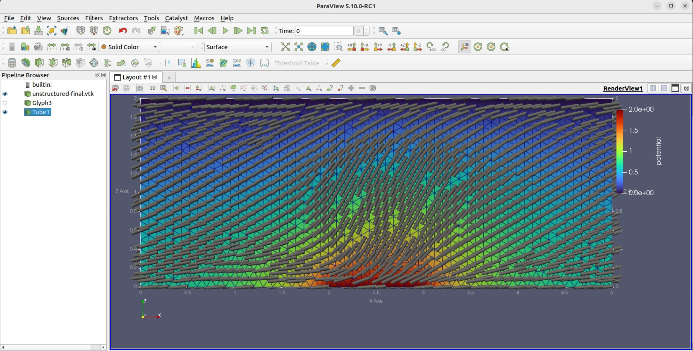

# Pseudo-2D Example
The structure is a 2D slice in the x-z plane with the top surface (zmax) being an Electrode1/FixLC1 surface and 
the bottom surface being a FixLC2 surface with a small Electrode2 in the centre. The left and right boundaries at xmin and xmax 
are Periodic. 

- The mesh is generated using Gmsh (http://gmsh.info/). The structure is defined in the file [geometry.geo](geometry.geo). 
- The simulation parameters are defined in the file [settings.txt](settings.txt). 

## Result

The background colour is the electric potential.