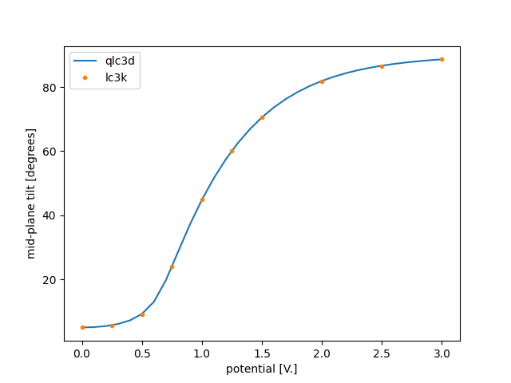

# Steady-State Switching

The stead

## Running 
Edit the `run.py` python script to set the path to the qlc3d executable and un the script to calculate the steady-state mid-cell tilt angle in a 1 micron TN cell for for 0-3 V. range of potentials.   

```
python3 ./run-test.py
```
## Result

