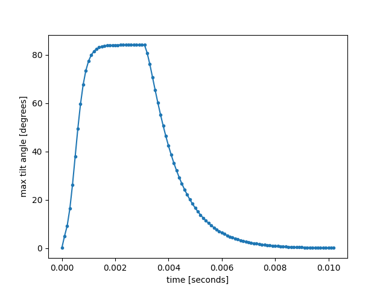

# Steady-State Switching

Edit the `run.py` to set the corect path to qlc3d executable and run it. This calculate the mid-cell tilt angle in a 1 micron TN cell when a 2 volt switching potential is applied for 3 milliseconds, and then removed to allow the LC to relax for a further 7 milliseconds. 

```
python3 ./run-test.py
```


## Result
Expected result:


